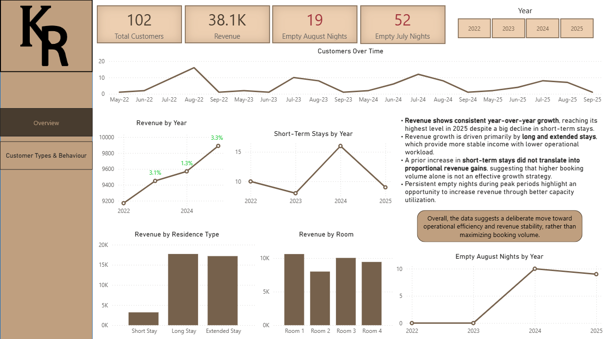

# Rental Business Data Analysis

This project analyzes booking behavior and revenue trends for a small rental business, focusing on customer types, stay duration, and operational efficiency.

## Key Insights
- Revenue increased year over year despite fewer short-term stays.
- Long and extended stays drive higher value and lower operational workload.
- Referral customers are more strongly associated with extended stays, suggesting higher retention and engagement.
- Peak-season empty nights indicate untapped revenue potential.

## Dashboard Overview
### Overview

### Customer Types & Behaviour

## Tools Used
- Power BI
- Excel
- Data cleaning and transformation
- Exploratory data analysis

## Notes
This dashboard was created as a portfolio project to demonstrate analytical thinking, data storytelling, and business insight generation.
